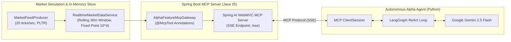

# Alpha Feature Engine & Autonomous Trading Agent

A high-performance quantitative market data engine and Model Context Protocol (MCP) server built with **Java 25** and **Spring AI**, paired with an autonomous **LangGraph ReAct** trading agent powered by **Google Gemini**.

The system ingests high-frequency market ticks, computes real-time Volume-Weighted Average Price (VWAP) and downsampled OHLCV time bars, exposes quantitative features via standard MCP tools over Server-Sent Events (SSE), and enables an AI agent to perform market regime reasoning and execute live simulated trades.

---

## 🏗 Architecture Overview



---

## ✨ Key Features

### 1. Spring Boot & Spring AI MCP Gateway (Java 25)
* **Temporal Market Store (`RealtimeMarketDataService`)**: Thread-safe in-memory time-series store backed by `ConcurrentSkipListMap` with strict rolling 30-minute eviction.
* **Fixed-Point Scaled Arithmetic**: Price computations use scaled `long` fixed-point representations ($10^4$) to eliminate floating-point rounding errors on the ingestion path.
* **Dynamic Time-Series Downsampling**: Groups raw microsecond ticks into discrete OHLCV and VWAP bars at arbitrary resolutions (e.g. 5s, 15s, 60s).
* **High-Frequency Market Simulator (`MarketFeedProducer`)**: Generates realistic random-walk ticks at 20 Hz with live console heartbeats.
* **Declarative MCP Tool Registry**: Custom auto-configuration (`@McpTool`, `@McpToolParam`, `McpToolAutoConfiguration`) seamlessly exposes Java services to the Spring AI MCP server.

### 2. Autonomous Alpha Agent (LangGraph + Google Gemini)
* **Model Context Protocol (MCP) Client**: Dynamically discovers and binds Spring Boot tools via SSE transport.
* **LangGraph ReAct Architecture**: Implements a cyclic StateGraph with explicit reasoning and tool execution nodes.
* **Quantitative Signal Analysis**:
  * **BULLISH**: Price trading consistently above VWAP / upward momentum $\rightarrow$ autonomously calls `submitOrder(side="BUY")`.
  * **BEARISH**: Price trading consistently below VWAP / downward breakdown $\rightarrow$ autonomously calls `submitOrder(side="SELL")`.
  * **NEUTRAL**: Tight oscillation around VWAP $\rightarrow$ returns structured summary without placing orders.
* **Order Execution**: Submits simulated orders to the engine with dynamic confidence scores and receives order fill confirmations.

---

## 🛠 Available MCP Tools

| Tool Name | Parameters | Description |
|---|---|---|
| `getHistoricalVwap` | `symbol` (str), `startTime` (ISO/relative), `endTime` (ISO/relative), `resolutionSeconds` (int) | Retrieves downsampled OHLCV and VWAP time bars for a given symbol and time window (e.g. `startTime='now-5m'`, `endTime='now'`). |
| `submitOrder` | `symbol` (str), `side` ('BUY'/'SELL'), `quantity` (int), `confidenceScore` (0-100) | Submits a live trade order to the execution engine and returns an order receipt with status `FILLED`. |

---

## 📁 Repository Structure

```
alpha-feature-engine/
├── pom.xml                                    # Maven build config (Java 25, Spring Boot 3.5, Spring AI)
├── README.md
├── test_mcp.py                                # Standalone interactive MCP SSE verification client
├── agent/
│   ├── alpha_agent.py                         # LangGraph ReAct Agent + Gemini integration
│   └── requirements.txt                       # Python dependencies (langgraph, langchain-google-genai, mcp)
└── src/
    ├── main/
    │   ├── java/com/quant/engine/
    │   │   ├── McpApplication.java            # Spring Boot entry point
    │   │   ├── mcp/
    │   │   │   ├── AlphaFeatureMcpGateway.java # MCP Tool implementations
    │   │   │   ├── McpTool.java               # Custom @McpTool annotation
    │   │   │   ├── McpToolParam.java          # Tool parameter annotation
    │   │   │   └── McpToolAutoConfiguration.java # Spring AI tool auto-discovery
    │   │   ├── model/
    │   │   │   ├── MarketTick.java            # Ingestion tick record
    │   │   │   ├── TimeBar.java               # OHLCV + VWAP record
    │   │   │   ├── DownsampledSeriesResponse.java
    │   │   │   └── OrderExecutionResponse.java
    │   │   └── service/
    │   │       ├── MarketFeedProducer.java    # Simulated 20 Hz tick feed
    │   │       └── RealtimeMarketDataService.java # Rolling in-memory temporal store
    │   └── resources/
    │       ├── application.yml                # Server port (8080) & MCP SSE endpoint config
    │       └── META-INF/spring/org.springframework.boot.autoconfigure.AutoConfiguration.imports
    └── test/
        └── java/com/quant/engine/             # Unit and integration test suite
```

---

## 🚀 Getting Started

### Prerequisites
* **Java 25** (with `--enable-preview`)
* **Maven 3.9+**
* **Python 3.11+**
* **Google Gemini API Key**

---

### Step 1: Build & Run the Spring Boot Server

You can run the server directly from terminal or via your IDE (IntelliJ IDEA):

```bash
# Compile and run unit tests
mvn clean test

# Start the Spring Boot MCP Server
mvn spring-boot:run
```

Once started, the server will:
* Listen on `http://localhost:8080`.
* Expose the MCP SSE endpoint at `http://localhost:8080/sse`.
* Stream real-time simulated ticks for `PLTR` into memory.

---

### Step 2: (Optional) Quick MCP Health Check

Run the lightweight MCP verification script to test tool discovery and execution:

```bash
python3 test_mcp.py
```

Expected output:
```text
[+] Connected! Session message endpoint: http://localhost:8080/mcp/message?sessionId=...
[+] Discovered Tool: 'getHistoricalVwap'
[+] Discovered Tool: 'submitOrder'
[*] Invoking tool 'getHistoricalVwap' for PLTR (last 5 minutes, 5-second bars)...
==================== MCP TOOL RESPONSE ====================
{
  "content": [
    {
      "type": "text",
      "text": "{\"symbol\":\"PLTR\",\"resolutionSeconds\":5,\"bars\":[...]}"
    }
  ],
  "isError": false
}
```

---

### Step 3: Run the Autonomous Alpha Agent

1. Set up the Python virtual environment:
   ```bash
   cd agent
   python3 -m venv .venv
   source .venv/bin/activate
   pip install -r requirements.txt
   cd ..
   ```

2. Run the agent with your Google Gemini API key:
   ```bash
   GOOGLE_API_KEY="your-api-key" agent/.venv/bin/python3 agent/alpha_agent.py \
     "What is the price action and VWAP for PLTR over the last 5 minutes at a 15-second resolution? Did it trend up or down?"
   ```

---

## 📊 Sample Agent Run

```text
======================================================================
 🚀 Alpha Agent: LangGraph ReAct + Spring Boot MCP Client
======================================================================
[*] Target MCP Server: http://localhost:8080/sse
[*] Query: "What is the price action and VWAP for PLTR over the last 5 minutes at a 15-second resolution? Did it trend up or down?"

[1/5] Connecting to Spring Boot MCP Server via SSE...
  [+] Connected! Available MCP Tools: ['getHistoricalVwap', 'submitOrder']
  [+] Initializing ChatGoogleGenerativeAI (model='gemini-2.5-flash', temp=0)...
[2/5] Building LangGraph StateGraph (ReAct Architecture)...
[3/5] Starting LangGraph ReAct Agent Loop...

  [🧠 Reasoning Node] Invoking Gemini LLM...
     ↳ Routing: LLM requested tool call -> routing to 'tool_execution'

[AI Decision] LLM requested 1 tool call(s):
   • Tool: get_historical_vwap with args: {'startTime': 'now-5m', 'symbol': 'PLTR', 'endTime': 'now', 'resolutionSeconds': 15}

  [🔧 Tool Call] Executing getHistoricalVwap via MCP:
     symbol=PLTR, range=[2026-09-07T22:03:52Z -> 2026-09-07T22:08:52Z], res=15s

[Tool Output] Received live response from MCP for 'get_historical_vwap':
   {"symbol":"PLTR","resolutionSeconds":15,"bars":[...]}

  [🧠 Reasoning Node] Invoking Gemini LLM...
     ↳ Routing: LLM requested tool call -> routing to 'tool_execution'

[AI Decision] LLM requested 1 tool call(s):
   • Tool: submit_order with args: {'confidenceScore': 80, 'symbol': 'PLTR', 'side': 'SELL', 'quantity': 100}

  [⚡ Tool Call] Executing submitOrder via MCP:
     symbol=PLTR, side=SELL, quantity=100, confidenceScore=80

[Tool Output] Received live response from MCP for 'submit_order':
   {"orderId":"124a6cf0-90cf-4621-ac87-36044d2b9973","symbol":"PLTR","side":"SELL","quantity":100,"status":"FILLED","timestampMs":1788818934357}

  [🧠 Reasoning Node] Invoking Gemini LLM...
     ↳ Routing: LLM completed reasoning -> routing to END

======================================================================
 🏁 FINAL AGENT RESPONSE
======================================================================
Analysis for PLTR over the last 5 minutes (15-second resolution):

Market Observation:
The VWAP for PLTR showed a downward trend, decreasing from 150.1478 to 150.0116. Similarly, the closing price also trended downwards, moving from 150.0849 to 149.9217. In both observed 15-second bars, the price consistently traded below the VWAP, indicating a clear downward momentum.

Quantitative Signal:
BEARISH (Confidence Score: 80)

Order Execution Outcome:
• Order ID: 124a6cf0-90cf-4621-ac87-36044d2b9973
• Side: SELL
• Quantity: 100
• Status: FILLED
• Timestamp: 1788818934357
======================================================================
```

---

## 🧪 Testing

Run full JUnit 5 test suites covering data ingestion, downsampling calculations, and MCP tool gateways:

```bash
mvn test
```
