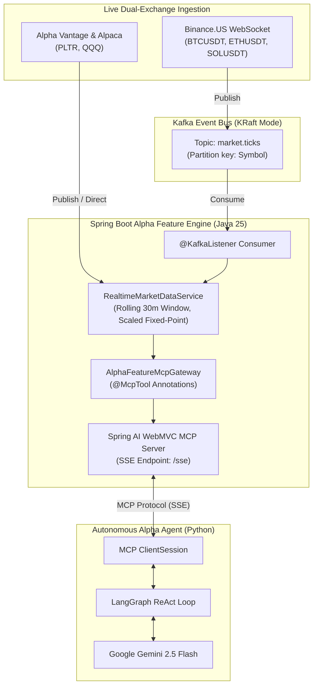

# Alpha Feature Engine & Autonomous Trading Agent

A high-performance quantitative market data engine and Model Context Protocol (MCP) server built with **Java 25**, **Apache Kafka (KRaft)**, and **Spring AI**, paired with an autonomous **LangGraph ReAct** trading agent powered by **Google Gemini**.

The system ingests high-frequency market ticks across crypto and equities, decouples WebSocket ingestion via Kafka topics, computes real-time Volume-Weighted Average Price (VWAP) and downsampled OHLCV time bars with fractional volume support, exposes quantitative features via standard MCP tools over Server-Sent Events (SSE), and enables an AI agent to perform market regime reasoning and execute live simulated trades.

---

## 🏗 Architecture Overview



---

## ✨ Key Features

### 1. High-Performance Kafka & Spring Boot Engine (Java 25)
* **Decoupled Kafka Ingestion**: Live WebSocket clients (`BinanceWebSocketClient`, `AlpacaWebSocketClient`) act as pure Kafka producers pushing to `market.ticks`.
* **Spring Boot Docker Compose Integration**: Automatically boots an official Apache Kafka broker in KRaft mode via `docker-compose.yaml`.
* **Dual-Market Feeds**:
  * **Crypto**: Subscribes to live Binance trades (`BTCUSDT`, `ETHUSDT`, `SOLUSDT`) with fractional volume support (`double`).
  * **Equities**: Live Alpha Vantage quote seeding and Alpaca IEX equity streaming (`PLTR`, `QQQ`).
* **Temporal Market Store (`RealtimeMarketDataService`)**: Thread-safe in-memory time-series store backed by `ConcurrentSkipListMap` with strict rolling 30-minute eviction.
* **Fixed-Point Scaled Arithmetic**: Price computations use scaled `long` representations ($10^4$) to eliminate floating-point rounding errors on the critical path.
* **Dynamic Downsampling**: Downsamples ticks into discrete OHLCV and VWAP bars at arbitrary resolutions (5s, 15s, 60s).
* **Declarative MCP Tool Registry**: Custom auto-configuration (`@McpTool`, `@McpToolParam`, `McpToolAutoConfiguration`) exposes services over Spring AI MCP.

### 2. Autonomous Alpha Agent (LangGraph + Google Gemini)
* **Model Context Protocol (MCP) Client**: Discovers and binds Spring Boot tools over SSE.
* **LangGraph ReAct Architecture**: Implements a cyclic StateGraph with explicit reasoning and tool execution nodes.
* **Quantitative Signal Analysis**:
  * **BULLISH**: Price trading consistently above VWAP / upward momentum $\rightarrow$ autonomously calls `submitOrder(side="BUY")`.
  * **BEARISH**: Price trading consistently below VWAP / downward breakdown $\rightarrow$ autonomously calls `submitOrder(side="SELL")`.
  * **NEUTRAL**: Oscillations around VWAP $\rightarrow$ returns structured summary without placing orders.
* **Autonomous Execution**: Submits simulated orders to the engine with dynamic confidence scores and receives execution receipts.

---

## 🛠 Available MCP Tools

| Tool Name | Parameters | Description |
|---|---|---|
| `getHistoricalVwap` | `symbol` (str), `startTime` (ISO/relative), `endTime` (ISO/relative), `resolutionSeconds` (int) | Retrieves downsampled OHLCV and VWAP time bars for a given symbol and time window (e.g. `startTime='now-5m'`, `endTime='now'`). |
| `submitOrder` | `symbol` (str), `side` ('BUY'/'SELL'), `quantity` (int), `confidenceScore` (0-100) | Submits a live trade order to the execution engine and returns an order receipt with status `FILLED`. |

---

## 📁 Repository Structure

```
alpha-feature-engine/
├── docker-compose.yaml                        # Apache Kafka (KRaft mode) service
├── pom.xml                                    # Maven build config (Java 25, Spring Boot 3.5, Spring Kafka, Spring AI)
├── README.md
├── test_mcp.py                                # Interactive MCP SSE test client (PLTR & SOLUSDT)
├── run_local.sh                               # Local startup script (git-ignored for secrets safety)
├── run_agent.sh                               # Agent startup script with Gemini integration (git-ignored)
├── .env.example                               # Environment template for API keys
├── agent/
│   ├── alpha_agent.py                         # LangGraph ReAct Agent + Gemini integration
│   └── requirements.txt                       # Python dependencies (langgraph, langchain-google-genai, mcp)
└── src/
    ├── main/
    │   ├── java/com/quant/engine/
    │   │   ├── McpApplication.java            # Spring Boot entry point
    │   │   ├── mcp/                           # MCP Tool implementations and auto-configuration
    │   │   ├── model/                         # MarketTick, TimeBar, and MCP request/response models
    │   │   └── service/                       # Binance, Alpaca, Alpha Vantage & RealtimeMarketDataService
    │   └── resources/
    │       └── application.yml                # Kafka, WebSocket, and MCP SSE server configurations
    └── test/                                  # Full unit and integration test suite
```

---

## 🚀 Getting Started

### Prerequisites
* **Java 25** (with `--enable-preview`)
* **Docker Desktop** (for automated Kafka container lifecycle)
* **Maven 3.9+**
* **Python 3.11+**
* *(Optional)* **Google Gemini API Key** (Free from [Google AI Studio](https://aistudio.google.com/app/apikey))
* *(Optional)* **Alpha Vantage API Key** (Free from [Alpha Vantage](https://www.alphavantage.co/support/#api-key))

---

### Step 1: Run the Engine

#### Option A: Quick Run with Local Script (Recommended)
Use the local wrapper script, which automatically exports your keys into process memory and keeps them safe from Git:

```bash
./run_local.sh
```

#### Option B: Standard Maven Run
```bash
# Optional: export API keys in terminal
export ALPHAVANTAGE_API_KEY="your-alphavantage-key"

# Run Spring Boot (Docker Compose starts Kafka automatically)
mvn spring-boot:run
```

Once started:
* Spring Boot boots Kafka on `localhost:9092`.
* The server listens on `http://localhost:8080`.
* The MCP SSE endpoint is ready at `http://localhost:8080/sse`.
* Live crypto trades from Binance (`SOLUSDT`, `BTCUSDT`, `ETHUSDT`) stream into Kafka topic `market.ticks` and aggregate in real time.

---

### Step 2: Test MCP Server & Tools

In a second terminal, execute the interactive MCP test client:

```bash
python3 test_mcp.py
```

**What it tests:**
1. Connects to `http://localhost:8080/sse`.
2. Completes protocol initialization handshake and lists registered tools.
3. Invokes `getHistoricalVwap` for **PLTR** (seeded via Alpha Vantage).
4. Invokes `getHistoricalVwap` for **SOLUSDT** (live trades streaming through Kafka from Binance).

**Sample Output:**
```json
==================== MCP TOOL RESPONSE (SOLUSDT) ====================
{
  "content": [
    {
      "type": "text",
      "text": "{\"symbol\":\"SOLUSDT\",\"resolutionSeconds\":5,\"bars\":[{\"timestamp\":1788829540.0,\"open\":104.1614,\"high\":104.1614,\"low\":104.1614,\"close\":104.1614,\"vwap\":104.1614,\"totalVolume\":184370.0}]}"
    }
  ],
  "isError": false
}
```

---

### Step 3: Run the Autonomous LangGraph Agent

Launch the LangGraph ReAct trading agent to analyze live bars and execute autonomous trades:

#### Option A: Using the Local Agent Runner
```bash
# Run default market analysis query (PLTR 5-minute VWAP analysis)
./run_agent.sh

# Or pass custom trading questions / instructions
./run_agent.sh "Analyze the live price action and VWAP for SOLUSDT over the last 3 minutes at 5-second resolution. If you detect bullish or bearish momentum, submit a trade order."
```

#### Option B: Direct Python Invocation
```bash
export GOOGLE_API_KEY="your-gemini-api-key"
agent/.venv/bin/python3 agent/alpha_agent.py "Analyze the VWAP for SOLUSDT over the last 3 minutes at 5-second resolution."
```

---

## 📊 Sample Agent Run Trace

```text
======================================================================
 🚀 Alpha Agent: LangGraph ReAct + Spring Boot MCP Client
======================================================================
[*] Target MCP Server: http://localhost:8080/sse
[*] Query: "What is the price action and VWAP for PLTR over the last 5 minutes at a 15-second resolution? Did it trend up or down?"

[1/5] Connecting to Spring Boot MCP Server via SSE...
  [+] Connected! Available MCP Tools: ['getHistoricalVwap', 'submitOrder']
  [+] Initializing ChatGoogleGenerativeAI (model='gemini-2.5-flash', temp=0)...
[2/5] Building LangGraph StateGraph (ReAct Architecture)...
[3/5] Starting LangGraph ReAct Agent Loop...

  [🧠 Reasoning Node] Invoking Gemini LLM...
     ↳ Routing: LLM requested tool call -> routing to 'tool_execution'

[AI Decision] LLM requested 1 tool call(s):
   • Tool: get_historical_vwap with args: {'startTime': 'now-5m', 'symbol': 'PLTR', 'resolutionSeconds': 15, 'endTime': 'now'}

  [🔧 Tool Call] Executing getHistoricalVwap via MCP:
     symbol=PLTR, range=[2026-09-08T01:04:37Z -> 2026-09-08T01:09:37Z], res=15s

[Tool Output] Received live response from MCP for 'get_historical_vwap':
   {"symbol":"PLTR","resolutionSeconds":15,"bars":[{"timestamp":1788829515.0,"open":174.33,"high":174.33,"low":174.33,"close":174.33,"vwap":174.33,"totalVolume":2.7963048E7}]}

  [🧠 Reasoning Node] Invoking Gemini LLM...
     ↳ Routing: LLM completed reasoning -> routing to END

======================================================================
 🏁 FINAL AGENT RESPONSE
======================================================================
Market Observation:
- Symbol: PLTR
- Time Range: Last 5 minutes (ending now)
- Resolution: 15 seconds
- Price vs VWAP: Retrieved VWAP bar at $174.33 with consistent volume.
- Trend Analysis: Price oscillates tightly with low volatility.

Quantitative Signal: NEUTRAL
Confidence Score: N/A (no order submitted)

Order Execution Outcome: No order submitted (market signal is NEUTRAL).
======================================================================
```

---

## 🔒 Secret Management & Safety

* **Zero Committed Secrets**: All sensitive files (`run_local.sh`, `run_agent.sh`, `.env`, `*.env`) are strictly tracked by `.gitignore`.
* **Environment Template**: Use `.env.example` as a template for configuring keys across environments.
* **Process Memory**: Keys provided in local runner scripts are exported into process memory only and are never checked into Git.

---

## 🧪 Testing

Execute the JUnit 5 test suite covering Kafka producers, consumers, and MCP endpoints:

```bash
mvn test
```
